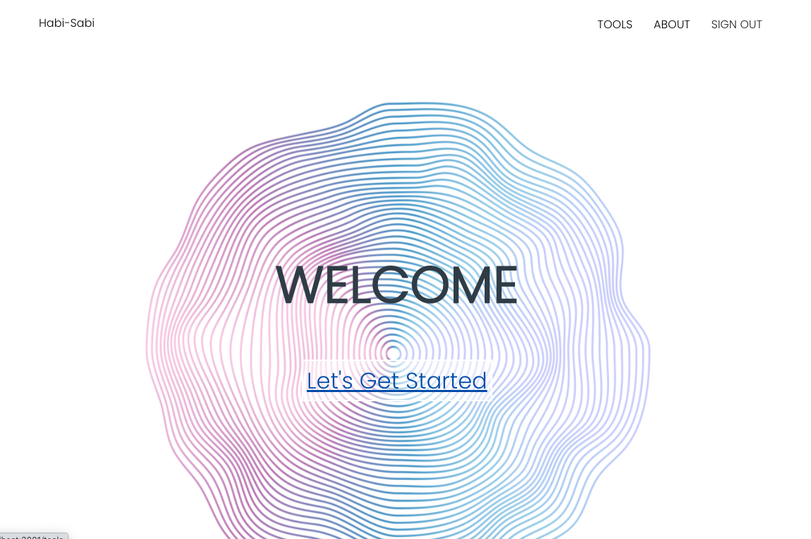
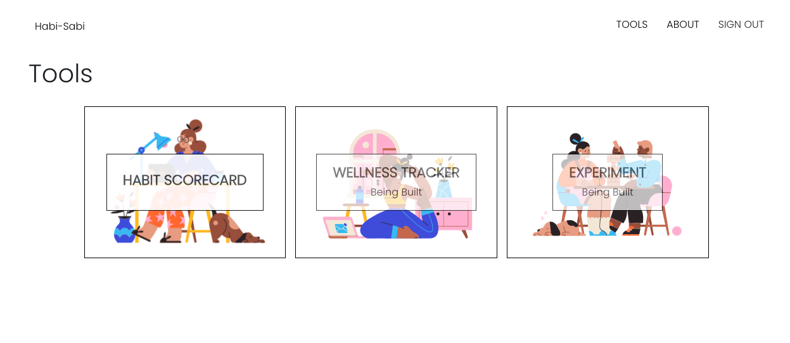
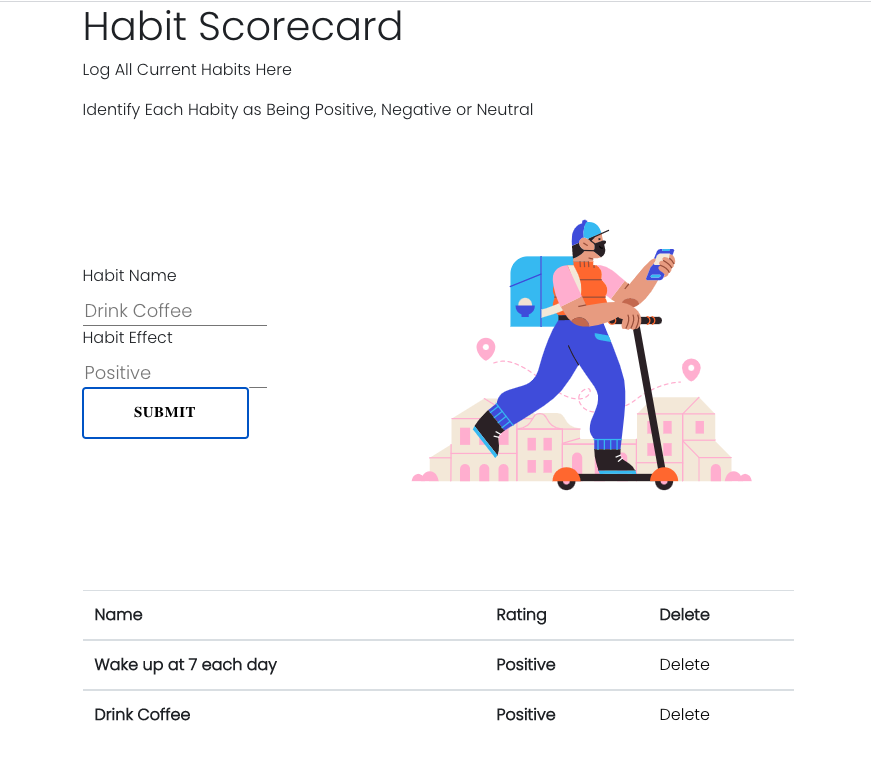

<h1 align="center"><strong>Habi-Sabi</strong></h1>

<h4 align="center"><em>Try Something New</em></h4>

---

<h4 align="center">Created: 10/8/2020</h4>
<h4 align="center">Last Updated: 10/8/2020</h4>

---

<h4 align="center"><strong>Created By: Teresa Rosinski</strong></h>

  
[**TeresaRosinski**](https://github.com/TeresaRosinski)
| Teresa Rosinski

---

## Functionality

**The goal of this appplication is to help users become more self-aware and make empowered choices regarding the habits in their lives. According to Charles Duhigg, our habits dictate our life. To make a real change in our day-to-day, we've got to change our habits.**

### Ideal Funcionalty

**_Habit Scorecard_**

##### According to Atomic Habits, the first step in building up great habits involves creating a Habit Scorecard. This allows the user to get a snapshot of their current life by logging all of their current habits and labeling them as 'positive', 'negative', or 'neutral'.

**_General Wellness Tracker_**

#### The General Wellness Tracker will allow users to track the wellbeing of specific areas of their lives on a consistent basis. For example, a user may want to track levels of energy, anxiety, hopefullness, time spent with family, time spent with work etc. The goal of this is to have a continual log of a persons life so that they can see the impact new habits are having.

**_Experiment with a Habit_**

#### This will give users strategies and tracking methods to test out new habits.

**_Desired Habits List_**

#### This will allow users to keep a running tab of new habits they want to implement in their lives. After they feel they have incorporated one habit into their lives, they can try a new one.

## Setup/Installation Requirements

-Clone the GitHub repository by running git clone https://github.com/TeresaRosinski/habi-sabi in the terminal.Or download the ZIP file by clicking on Code then Download ZIP from this repository.
-Open the program in a code editor.
-In the terminal, CD into 'habi-sabi'
-Type 'npm install' in the command line to install the necessary packages.
--Type 'npm start' in the command line to run the program.
Further directions automatically generated by create-react-app are listed below.

## Importing and Updating the Database

- This project uses a firebase database.
  -Create a firebase account
  -Copy and paste your own firebase configutation code into 'src/firebase/firebase.utils.js'

## Known Bugs

- There is some funky stuff happening with the UI that needs to be fixed.

## Support and contact details

- Name: Teresa Rosinski
  - GitHub:[TeresaRosinski](https://github.com/TeresaRosinski)
  - LinkedIn: [TeresaRosinski](https://www.linkedin.com/in/teresarosinski/)
  - Email: trosinski89@gmail.com

## Technologies Used

- Visual Studio Code
- Javascript
- React
- HTML / CSS / SASS
- Firebase
- [DrawKit](https://www.drawkit.io/)

### License

Copyright (c) 2020 **_Teresa Rosinski_**

This software is licensed under the MIT license.

### Automatically Generated Information:

This project was bootstrapped with [Create React App](https://github.com/facebook/create-react-app).

## Available Scripts

In the project directory, you can run:

### `yarn start`

Runs the app in the development mode. 
Open [http://localhost:3000](http://localhost:3000) to view it in the browser.

The page will reload if you make edits. 
You will also see any lint errors in the console.

### `yarn test`

Launches the test runner in the interactive watch mode. 
See the section about [running tests](https://facebook.github.io/create-react-app/docs/running-tests) for more information.

### `yarn build`

Builds the app for production to the `build` folder. 
It correctly bundles React in production mode and optimizes the build for the best performance.

The build is minified and the filenames include the hashes. 
Your app is ready to be deployed!

See the section about [deployment](https://facebook.github.io/create-react-app/docs/deployment) for more information.

### `yarn eject`

**Note: this is a one-way operation. Once you `eject`, you can’t go back!**

If you aren’t satisfied with the build tool and configuration choices, you can `eject` at any time. This command will remove the single build dependency from your project.

Instead, it will copy all the configuration files and the transitive dependencies (webpack, Babel, ESLint, etc) right into your project so you have full control over them. All of the commands except `eject` will still work, but they will point to the copied scripts so you can tweak them. At this point you’re on your own.

You don’t have to ever use `eject`. The curated feature set is suitable for small and middle deployments, and you shouldn’t feel obligated to use this feature. However we understand that this tool wouldn’t be useful if you couldn’t customize it when you are ready for it.

## Learn More

You can learn more in the [Create React App documentation](https://facebook.github.io/create-react-app/docs/getting-started).

To learn React, check out the [React documentation](https://reactjs.org/).

### Code Splitting

This section has moved here: https://facebook.github.io/create-react-app/docs/code-splitting

### Analyzing the Bundle Size

This section has moved here: https://facebook.github.io/create-react-app/docs/analyzing-the-bundle-size

### Making a Progressive Web App

This section has moved here: https://facebook.github.io/create-react-app/docs/making-a-progressive-web-app

### Advanced Configuration

This section has moved here: https://facebook.github.io/create-react-app/docs/advanced-configuration

### Deployment

This section has moved here: https://facebook.github.io/create-react-app/docs/deployment

### `yarn build` fails to minify

This section has moved here: https://facebook.github.io/create-react-app/docs/troubleshooting#npm-run-build-fails-to-minify
